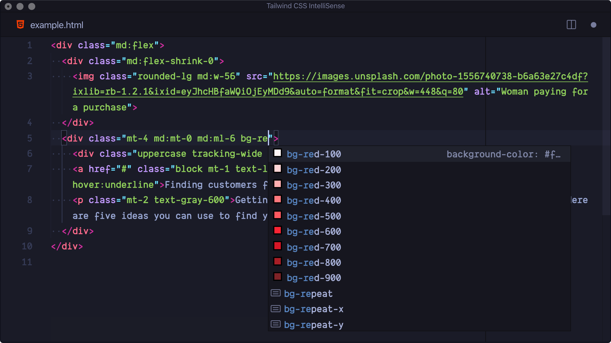

# The making of this site

::: warning
Let's start by saying that this is my first blog ever, this means that I don't have any sort of previous experience making this blog a possible bad example to take inspiration from.
:::
That being said if you like how the site and blog are designed go ahead with the reading. 

## Why this site?
Why did I decide to build this website? It's pretty simple, I did it to showcase some of my projects so that people can decide by themselves whether or not I have the sufficient skills to take on the requested project.\
That being said I always wanted to have my little space where I can share my ideas, so that other people can have a different POV of the problem and I can learn by the comments that I will get from people disagreeing with me.

## The stack

To make this site I used:

   <strong>Tailwind</strong> +
   <strong>VitePress</strong> +
  <svg xmlns="http://www.w3.org/2000/svg" width="24" height="24" viewBox="0 0 48 48" style="vertical-align: middle;">
    <polygon fill="#81c784" points="23.987,17 18.734,8 2.974,8 23.987,44 45,8 29.24,8"></polygon>
    <polygon fill="#455a64" points="29.24,8 23.987,17 18.734,8 11.146,8 23.987,30 36.828,8"></polygon>
  </svg>
  <strong>Vue</strong>

Let's go one step at the time, what are these tools and why did I choose them?

### Tailwind
Let's start with Tailwind. I chose Tailwind specifically because it makes writing CSS way less painful, especially with the Tailwind Intellisense extension.

I don't have to create useless classes and can just use all the attributes that I want in a single place. Making my code painful to read but very fast to write kinda like Perl, but we'll discuss the Perl programming language another time.

### VitePress
If you're reading this blog post is only thanks to VitePress, an amazing tool to create static websites like blog posts easily with Markdown.
::: info I can also easily create boxes
there are many extensions to make Markdown more interesting like this one
:::

Being an **open source** project like all the stack used to make this website there are many plugins like the one used to enable comments with giscus.

### <svg xmlns="http://www.w3.org/2000/svg" width="24" height="24" viewBox="0 0 48 48" style="vertical-align: middle;"><polygon fill="#81c784" points="23.987,17 18.734,8 2.974,8 23.987,44 45,8 29.24,8"></polygon><polygon fill="#455a64" points="29.24,8 23.987,17 18.734,8 11.146,8 23.987,30 36.828,8"></polygon></svg>Vue
Vue is an amazing framework that supports TypeScript, to be honest I don't have strong feeling about any framework in general, that's probably because I generally prefer doing backend stuff, but I always had good experiences with Vue being a pretty well known and documented framework.\
I chose Vue over the thousands of other frameworks specifically because the creators of Vue and Vite are the same.

## What's next?

I would like in the future to improve this site, right now I just made the basic structure to eventually improve it later one step at the time.\
I hope to write articles that many people will find useful and to contribute positively to the open source community by sharing interesting software and by building it by myself.